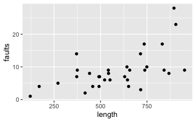
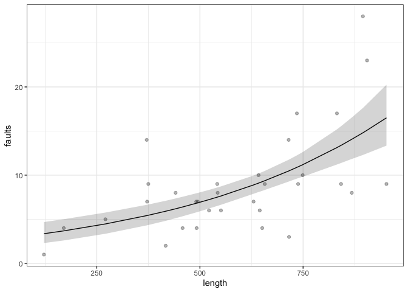
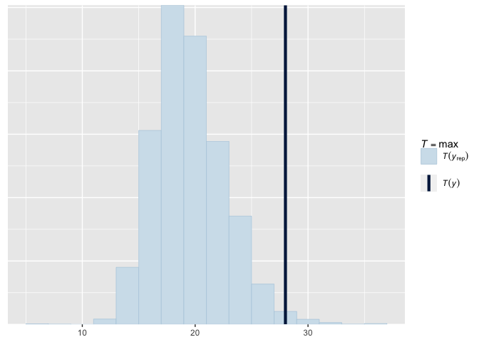

Bayesian Data Analysis
================
Dr Niamh Cahill (she/her)
Bayesian Generalised Linear Models

## Poisson Regression

Suppose response $Y$ is a count response and takes values 0, 1, 2, 3, …
We could model $Y$ as:

$$Y \sim \mbox{Poisson}(\mu), \;\;\; \mu > 0$$

-   Poisson is a discrete probability distribution that expresses the
    probability of a given number of events occurring in a fixed
    interval of time or space (distance, area, volume etc).

-   We assume these events occur with a known constant rate and
    independently of the time since the last event.

## Poisson Regression

It follows that:

$$P[Y=k] = \displaystyle\frac{e^{-\mu}\mu^{k}}{k!}\;\;\; \mbox{for} \;\;\;k=0, 1, 2, ...$$
$$\mathbb{E}[Y] = \mu, \;\;\; \mbox{Var}[Y] = \mu.$$

The Poisson regression model is of the form:
$$\mbox{log}(\mu) = \beta_0 + \beta_1x_1 + ... + \beta_kx_k.$$

-   Poisson regression is a **generalized linear model** with a log
    **link function** that relates $\mathbb{E}[Y]$ to the **systematic
    component**, which is a linear function of explanatory variables
    used in the model.

## Why not use regular linear regression?

-   So far, we discussed regression problems where the data were assumed
    to be normally distributed.

-   That’s not always an appropriate assumption, for example when
    dealing with count data, e.g. death counts due to lip cancer in
    Scotland;

    -   Data not normally distributed.

    -   Variance is not constant.

Note: for sufficiently large values of $\mu$, the normal distribution
with mean $\mu$ and variance $\mu$ can be used as an approximation to
the Poisson distribution. Thus for large counts we may be able to use
linear regression.

## Interpretation of parameter estimates

Suppose $X_1$ increases from $x_1$ to $x_1+1$ and other $x$’s remain
fixed. Then $\mu$ changes from

$$\mu(x) = \mbox{exp}(\beta_0 + \beta_1 x_1 + ... + \beta_k x_k)$$ to

Each unit increase in $x_1$ multiplies the mean response by
$e^{\beta_1}$.

If $\beta_1 = 0, e^{\beta_1}=1$ and the mean is unaffected by changes in
$x_1$.

<!-- ## Poisson Regression: Introduction -->
<!-- \footnotesize -->
<!--   - So far, we discussed regression problems where the data were assumed to be normally distributed. -->
<!-- - That's not always an appropriate assumption, for example when dealing with -->
<!--     - count data, e.g. death counts due to lip cancer in Scotland; -->
<!-- - We will a discuss (hierarchical) poisson regression model to answer questions using these types of data.  -->
<!-- - Suppose that $y_1,y_2,\ldots,y_n$ are independent count observations. -->
<!-- - If $y_i\sim\mbox{Poisson}(\lambda)$ then -->
<!-- $${\mathbb P}\{y_i=y\}=\frac{\lambda^y \exp(-\lambda)}{y!}, \mbox{ where $\lambda>0$.}$$ -->
<!-- - Under this model,  -->
<!-- $${\mathbb E}(y)=\lambda \mbox{ and } {\mathbb V}\mbox{ar}(y)=\lambda.$$ -->
<!-- - So, the model cannot account for situations where $${\mathbb E}(y)\neq {\mathbb V}\mbox{ar}(y).$$ -->

## Count Data Example - Fabric Faults

-   Data: Numbers of faults found in 32 rolls of fabric produced in a
    particular factory (Hinde, J. (1982))  
-   Predictor: the length of each roll.

<!-- -->

## Model Specification

-   A standard choice for count data is the Poisson data model:

$y_i|\lambda_i \sim$ Poisson($\lambda_i$)

-   We need to specify how the fabric length $x_i$ relates to the
    parameter of interest $\lambda_i$

-   We can try a regression model, e.g. log($\lambda_i$) =
    $\alpha + \beta (x_i - \bar{x})$

-   This is the Poisson regression model, which is an example of a
    generalized linear model, with

    -   linear predictor $\alpha + \beta (x_i - \bar{x})$ (linear in the
        parameters) and
    -   a log-link function, such that log(E($y_i$)) equals the linear
        predictor.

## JAGS Specification

$y_i|\lambda_i \sim$ Poisson($\lambda_i$)

$log(\lambda_i) = \alpha + \beta (x_i - \bar{x})$

$\alpha \sim N(0, 10^2)$

$\beta \sim N (0,10^2)$

``` r
poismodel = "
model{
    for( i in 1:n ) {
 #Poisson likelihood for observed counts
  y.i[i] ~ dpois(lambda.i[i])
  lambda.i[i] <- exp(alpha + beta*(x.i[i] - mean(x.i)))
    }
 #Prior distributions
  alpha ~ dnorm(0, 10^-2)
  beta ~ dnorm(0, 10^-2)
  
  for(i in 1:n){yrep[i] ~ dpois(lambda.i[i])}
}
"
```

    ## module glm loaded

    ## Compiling model graph
    ##    Resolving undeclared variables
    ##    Allocating nodes
    ## Graph information:
    ##    Observed stochastic nodes: 32
    ##    Unobserved stochastic nodes: 34
    ##    Total graph size: 234
    ## 
    ## Initializing model

## Results: Parameters

    ## # A tibble: 2 × 7
    ##   .variable  .value  .lower  .upper .width .point .interval
    ##   <chr>       <dbl>   <dbl>   <dbl>  <dbl> <chr>  <chr>    
    ## 1 alpha     2.10    1.97    2.23      0.95 median qi       
    ## 2 beta      0.00192 0.00132 0.00255   0.95 median qi

## Results: Model Fit

<!-- -->

## Posterior Predictive Check

<!-- -->
