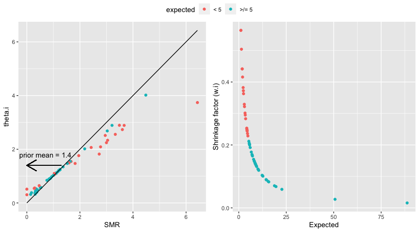
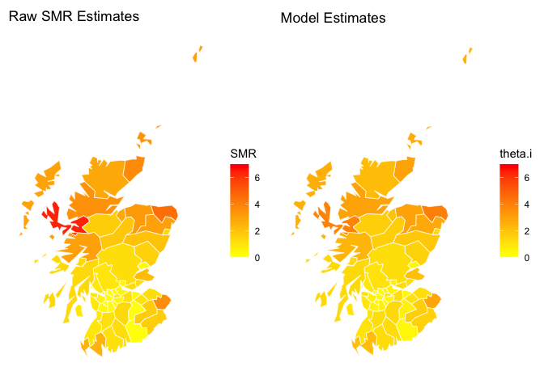
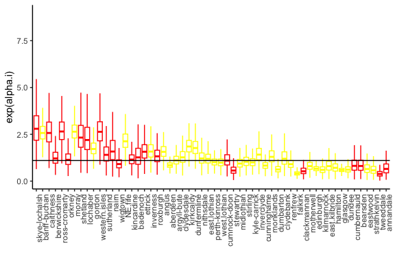
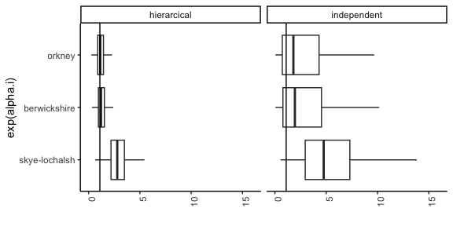
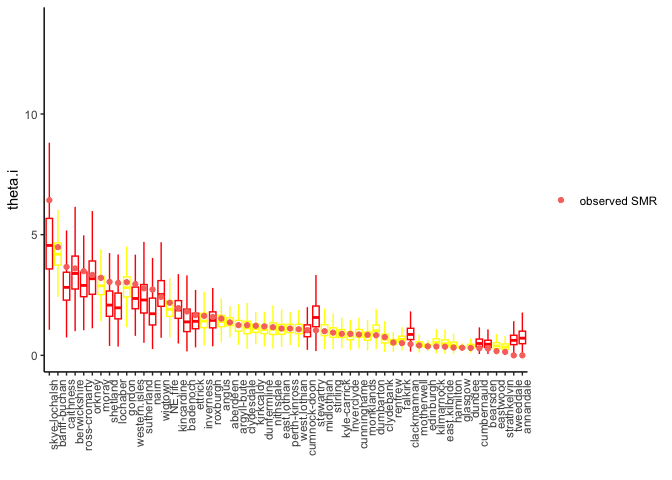
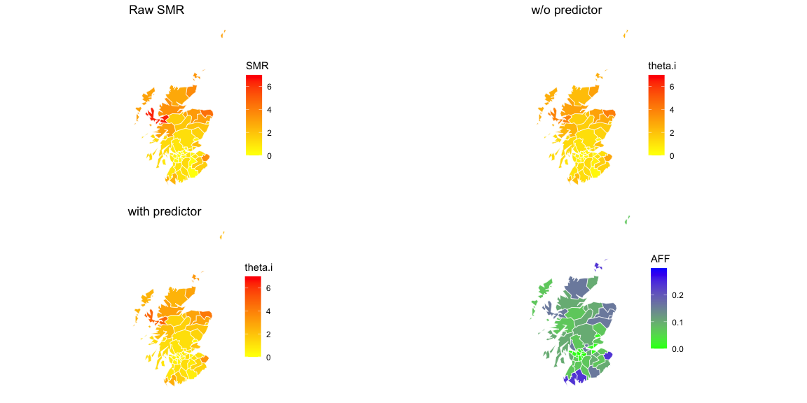

Bayesian Data Analysis
================
Dr Niamh Cahill (she/her)
Bayesian Hierarcical Models - Lip Cancer Case Study

## Example: Lip cancer study

-   We will now examine incidence rates of lip cancer deaths in males in
    56 counties of Scotland, registered in 1975–1980.

    -   Wakefield, Jonathan. “Disease mapping and spatial regression
        with count data.” Biostatistics 8 2 (2007): 158-83.

-   The data consist of the observed and expected numbers of deaths

    -   For each region the observed frequency of deaths $y_i$ was
        recorded for $i = 1, 2 \ldots, n$.

    -   An expected count $e_i$ was calculated based on age-specific
        reference rates (based on all data for all counties combined)
        and the population-by-age distribution in the county.

-   A covariate measuring the proportion of the population engaged in
    agriculture, fishing, or forestry (AFF) is also available (exposure
    to sunlight is a risk factor for lip cancer)

## Lip cancer study: more info

-   $SMR_i = y_i/e_i$ is referred to as the standardized morbidity ratio
    i.e., the ratio of the number of deaths observed in a population
    over a given period to the number that would be expected over the
    same period.

-   An estimate of the true (but unknown) relative risk is denoted by
    $\theta_i$ in county $i$, which captures the relative difference in
    risk of dying for county $i$ as compared to the reference
    population.

-   Problem: the SMRs in some regions are based on small $e_is$ (i.e.,
    for 22 counties $e_i < 5$) and the estimates are thus very
    uncertain.

-   Question: How to estimate county-specific relative risks?

-   Recall: that we also have the information on the percentage of the
    population working outside (in agriculture etc.). How do we use this
    information to improve the relative risk estimates?

## Estimating region specific mortality

-   As usual, we need to specify how the data relates to the parameter
    of interest, so here how death counts $y_i$ relate to relative risk
    $\theta_i$.

-   A standard choice for count data is the Poisson data model:
    $y_i|\lambda_i \sim Poisson(\lambda_i)$, where
    $\lambda_i = E(y_i) = Var(y_i).$

-   For the lip cancer data set, let’s consider the Poisson model with
    $\lambda_i = \theta_ie_i$, such that the mean death count is given
    by the expected death count times the relative risk.

-   How to estimate $\theta_i$?

-   Three choices:

    1.  Estimate $\theta_i$ for each county independently.

    2.  Assume $\theta_i$ is the same for all counties, $\theta_i$ =
        $\theta$: we would no longer investigate whether there are
        differences in relative risks.

    3.  Use a hierarchical model for the $\theta_i$’s to exchange
        information across counties.

## Hierarchical model for estimating relative risks

-   We will assume the data model:
    $y_i|\theta_i \sim Poisson(\theta_ie_i)$, $\theta_i > 0$.

-   A Gamma distribution results in full conditionals in closed form: if
    we set

$$\theta_i|\alpha, \beta \sim Gamma(\alpha, \beta)$$ with
$E(\theta_i) = \alpha/\beta$ and $Var(\theta_i) = \alpha/\beta^2$, then
we get a nice interpretable form for the posterior of $\theta_i$:

$$\theta_i|\alpha, \beta,y \sim Gamma(\alpha + y_i, \beta + e_i)$$

-   Think of $\alpha$ as “the prior number of death counts”

-   Think of $\beta$ as the “prior expected counts”

-   The posterior mean will be a weighted sum of the prior mean and the
    observed rel. risks

$\frac{\alpha + y_i}{\beta + e_i} = w_i \frac{\alpha}{\beta} + (1-w_i) \frac{y_i}{e_i}$

where the weight (or shrinkage factor) $w_i = \frac{\beta}{\beta + e_i}$

## JAGS Model

``` r
bhpoismodel = "
model{
for(i in 1:n) {
# Poisson likelihood (data model)
y.i[i] ~ dpois(lambda.i[i])
lambda.i[i] <- theta.i[i]*e.i[i]

# prior for theta
theta.i[i] ~ dgamma(alpha,beta)
# Shrinkage factor
w.i[i] <- beta/(beta + expect.i[i])
}
# Prior distributions for hyper parameters
alpha ~ dexp(0.1)
beta ~ dexp(0.1)
# store group mean and across-group variance
mtheta <- alpha/beta
sdtheta <- sqrt(alpha/(beta^2))
}
"
```

## Let’s explore the impact of the shrinkage

<!-- -->

This behavior illustrates both the potential benefits and hazards of
smoothing;

-   the estimates of $\theta_i$ will be less variable than the observed
    SMRs,
-   but an outlying estimate that is not based on a large expected
    number will be shrunk, and we may miss an important excess.

## Let’s visualise some results

Raw and smoothed estimates in 56 counties of Scotland.

    ## Warning: Using `size` aesthetic for lines was deprecated in ggplot2 3.4.0.
    ## ℹ Please use `linewidth` instead.
    ## This warning is displayed once every 8 hours.
    ## Call `lifecycle::last_lifecycle_warnings()` to see where this warning was
    ## generated.

<!-- -->

## Add in predictors for estimating the SMR

-   We have information on the the proportion of the population engaged
    in agriculture, fishing, or forestry (AFF) for each county ($x_i$)

-   A possible set-up:

$$y_i|\lambda_i \sim Poisson(\lambda_i)$$

$$\lambda_i = \theta_i e_i$$
$$log(\theta_i) = \alpha_i + \beta(x_i - \bar{x})$$
$$\alpha_i|\mu_{\alpha},\sigma_{\alpha} \sim N(\mu_{\alpha},\sigma_{\alpha})$$

-   Note: We switched to using normal distributions for the
    log-transformed county-specific intercepts.

## Add in predictors for estimating the SMR

``` r
bhpoismodel2 = "
model{
for(i in 1:n) {
# Poisson likelihood (data model)
y.i[i] ~ dpois(lambda.i[i])
lambda.i[i] <- theta.i[i]*e.i[i]

# prior for theta
log(theta.i[i]) <- ltheta.i[i]

ltheta.i[i] <- alpha.i[i] + beta*(x.i[i]-mean(x.i))
alpha.i[i] ~ dnorm(mu_alpha, sigma_alpha^-2)

}
# Prior distributions for hyper parameters
mu_alpha ~ dnorm(0,0.01)
beta ~ dnorm(0,0.01)
sigma_alpha ~ dt(0,2^-2,1)T(0,)
}
"
```

## Let’s look at $exp(\alpha_i)$

-   Boxplots are shown for $exp(\alpha_i)$ which is the expected SMR for
    counties where $\sim 9 \%$ work outside.

-   The solid black line is $exp(\mu_{\alpha})$ which is the expected
    SMR across all counties when $\sim 9\%$ work outside.

<!-- -->

## Compare $exp(\alpha_i)$ for an independent vs hierarchical model

-   The comparison below is for 3 counties that have expected $<5$

-   Note the difference in the uncertainty!!

<!-- -->

## Let’s look at $\theta_i$

<!-- -->

## Let’s visualise on a map

<!-- -->
