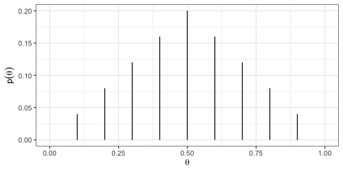
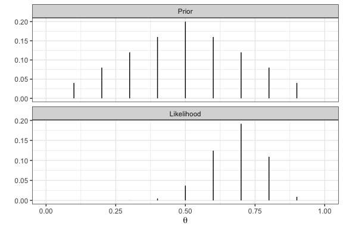
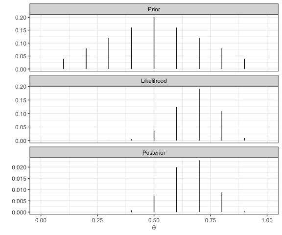
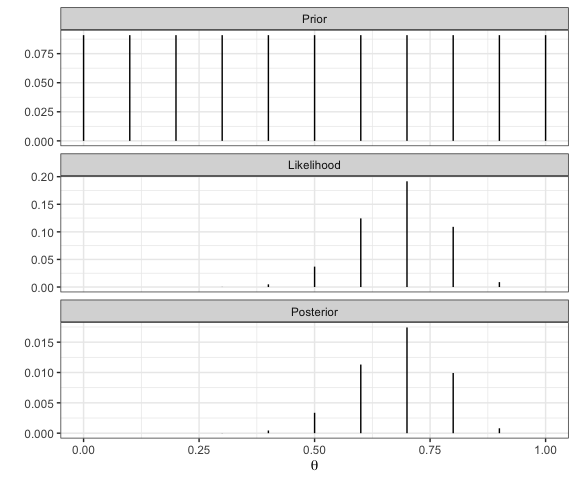

Bayesian Data Analysis
================
Dr Niamh Cahill (she/her)
Inferring a Binomial Probability

## Recall: Bayes’ rule

Given a set of observed data points $y$ and a set of parameters
$\theta$, we write Bayes’ rule as

$$\underset{\text{posterior}}{P(\theta|y)} = \frac{\underset{\text{likelihood}}{P(y|\theta)}\underset{\text{prior}}{P(\theta)}}{\underset{\text{marginal likelihood}}{P(y)}}$$
and as a proportional statement

$$\underset{\text{posterior}}{P(\theta|Y)} \propto \underset{\text{likelihood}}{P(Y|\theta)}\underset{\text{prior}}{P(\theta)}$$

We will now consider an example that will build some intuition for how
prior distributions and data interact to produce posterior
distributions.

## The Happiness example

Suppose females, aged 65+ in a general social survey were asked about
being happy. If this is a representative sample of the population of
women, what is the probability that a 65+ woman is happy?

**What is our goal?** To estimate the probability that a 65+ woman is
happy. This is an unknown parameter which we’ll call $\theta$.

**What data do we have?** Data: n = 20 women, y = 14 women reported
being happy

**How do we do Bayesian inference for $\theta$?**

-   Decide on a descriptive model for the data (i.e., the likelihood)
    with meaningful parameter(s), $\theta$ (e.g., the probability a 65+
    woman is happy).

-   Information about $\theta$ will be summarized in a prior probability
    distribution

-   and updated using the data, via the likelihood, to obtain the
    posterior distribution for the parameters using Bayes’ rule.

## Likelihood function - $p(y|\theta)$

**Data:** n = 20 women, y = 14 women reported being happy

We will assume that $y$ is Binomial$(\theta,n)$ such that

$$p(y|\theta) = c\theta^y(1-\theta)^{n-y} \text{ with } c = {n \choose y}$$

We’ll refer to $y|\theta \sim Bin(\theta,n)$ as the data model (or the
likelihood). It tells us how the data are related to the parameter(s) we
want to estimate.

## Prior distribution - $p(\theta)$

Now that we’ve defined the data model, the next step is to establish a
prior distribution over the parameter values.

-   Let’s start simple and assume $\theta$ can only take on values k =
    $0,0.1,0.2,\ldots,1$.

-   Suppose that we believe that $\theta$ is most likely to be 0.5 and
    we assign lower weight to $\theta$ values far above or below 0.5.

-   A prior distribution incorporating these beliefs might look like

<!-- -->

## Likelihood & Prior

Given that y = 14 and n = 20 with $\frac{y}{n} = 0.7$, which $\theta$
out of $0,0.1,0.2,\ldots,1$ do you expect to have the largest value of
the likelihood function?

<!-- -->

## Posterior distribution - $\underset{\text{posterior}}{P(\theta|Y)} \propto \underset{\text{likelihood}}{P(Y|\theta)}\underset{\text{prior}}{P(\theta)}$

<!-- -->

## Changing prior assumptions

Instead of the “triangular” prior let’s make a more uniform assumption.
So for $k = 0,0.1,0.2,\ldots,1$, $Pr(\theta = k) = 1/11$ (i.e., all are
equally likely).

<!-- -->

## Marginal likelihood - $p(y)$

Recall:
$$\underset{\text{posterior}}{P(\theta|y)} = \frac{\underset{\text{likelihood}}{P(y|\theta)}\underset{\text{prior}}{P(\theta)}}{\underset{\text{marginal likelihood}}{P(y)}}$$

What is $P(y)$?

$$P(y) = \sum_{\theta^*} P(y|\theta^*)P(\theta^*)$$

So for $k = 0,0.1,0.2,\ldots,1$, $Pr(\theta = k) = 1/11$ (i.e., all are
equally likely)

$P(y) = p(y|\theta = 0)Pr(\theta = 0) + P(y|\theta = 0.1)Pr(\theta = 0.1) + \ldots = 0.04$

**To do this in R:**

``` r
n_grid = 11
theta <- seq(0,1,length = n_grid) 
p_y <- (1/n_grid)*(sum(dbinom(14, 20, prob = theta)))
```
