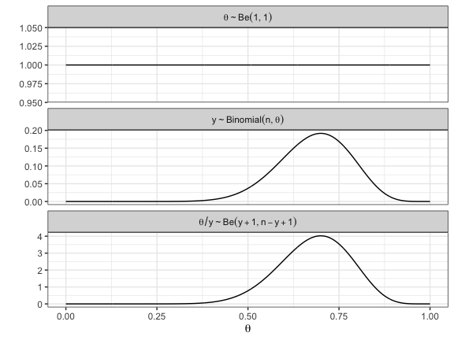

Bayesian Analysis - Beta Prior Distribution
================
Dr Niamh Cahill (she/her)

## Quick Recap

Recall:

$$\underset{\text{posterior}}{P(\theta|Y)} \propto \underset{\text{likelihood}}{P(Y|\theta)}\underset{\text{prior}}{P(\theta)}$$

For the Happiness example:

-   Data: n = 20 women, y = 14 women reported being happy

-   $y \sim Binomial(n = 20, \theta)$

    $$p(y|\theta) = c\theta^y(1-\theta)^{n-y} \text{ with } c = {n \choose y}$$

    -   We want to find the posterior distribution for $\theta$

    Now we will consider defining the prior, $p(\theta)$, with a known
    probability distribution, such that

$$\theta \sim Beta(a,b)$$

\## The Beta Prior

A Beta distribution is defined on the interval \[0,1\] and has two
parameters, $a$ and $b$. The density function is defined as

$$p(\theta|a,b) = \frac{1}{B(a,b)}\theta^{a-1}(1-\theta)^{b-1}$$

where $B(a,b)$ is a normalising constant that insures a valid
probability density function.

If $\theta \sim Be(a,b)$ then $E(\theta) = \frac{a}{a+b}$ and
$Var(\theta) = \frac{ab}{(a+b)^2(a+b+1)}$

Note $B(a,b)$ is not a function of $\theta$, so we can write

$$p(\theta|a,b) \propto \theta^{a-1}(1-\theta)^{b-1}$$

This will become useful later.

## The Beta Prior with a=1 and b=1

Let’s use Bayes’ theorem now to find the form of the posterior
distribution for $\theta$ assuming $\theta \sim Beta(a=1,b=1)$

This means we’ve assumed a prior mean and variance for $\theta$ of
$\frac{1}{2}$ and $\frac{1}{12}$ respectively.

So the posterior is

$$\underset{\text{posterior}}{p(\theta|y)} \propto \underset{\text{likelihood}}{\theta^y(1-\theta)^{n-y} }\underset{\text{prior}}{\theta^{a-1}(1-\theta)^{b-1}}$$

and given a = 1 and b = 1

$$\underset{\text{posterior}}{p(\theta|y)} \propto {\theta^y(1-\theta)^{n-y}}$$

This posterior actually takes the form of another Beta distribution with
parameters $y+1$ and $n-y+1$. So,

$$\theta|y \sim Beta(y+1, n-y +1)$$

## What does this look like for the Happiness example?

<!-- -->

## More on the Binomial Likelihood and the Beta Prior

It turns out anytime you use a Binomial likelihood and a Beta prior,
such that

$\theta \sim Be(a,b)$

$y \sim Binomal(n,\theta)$

then you get a posterior distribution which is also Beta, where

$$\theta|y \sim Beta(y+a, n-y +b)$$

When the posterior is the same form as the prior, the prior is said to
be a **conjugate prior**. The Beta prior is a conjugate prior for the
Binomial likelihood.

## The Posterior is a Compromise of Prior and Likelihood

The posterior distribution is always a compromise between the prior
distribution and the likelihood function.

We can illustrate this easily with the Beta-Binomial example.

We’ve seen that for a $Be(a,b)$ prior and a $Binomial(n,\theta)$
likelihood that the posterior will be of the form

$$\theta|y \sim Beta(y+a, n-y +b)$$

and so the posterior mean is $E(\theta|y) = \frac{y+a}{n + a + b}$.

This can be written as a weighted sum of the prior mean
($\frac{a}{a+b}$) and the data proportion ($\frac{y}{n}$), as follows:

$E(\theta|y) = \underbrace{\small\frac{y}{n}}_{data}\underbrace{\small\frac{n}{n+a+b}}_{weight} + \underbrace{\small\frac{a}{a+b}}_{prior}\underbrace{\small\frac{a+b}{n+a+b}}_{weight}$

\## Expressing prior knowledge as a Beta distribution

Suppose for the Happiness example, you want to express your underlying
belief about $\theta$ - the probability a woman age 65+ is happy.

Your beliefs may be based on previous studies or perhaps expert opinion.

So for example, supppose you want your prior to reflect beliefs that the
proportion is 0.6 $\pm$ 0.1.

How do we express this belief in the Beta distribution?

We will use something called **moment matching**.

## Moment Matching

Recall if $\theta \sim Be(a,b)$ then $E(\theta) = \frac{a}{a+b}$ and
$Var(\theta) = \frac{ab}{(a+b)^2(a+b+1)}$

Based on our prior beliefs we want:

$E(\theta) = \frac{a}{a+b} = 0.6$

$Var(\theta) = \frac{ab}{(a+b)^2(a+b+1)} = 0.1^2$

We can use these equations to solve for $a$ and $b$, the parameters of
the Beta prior.
