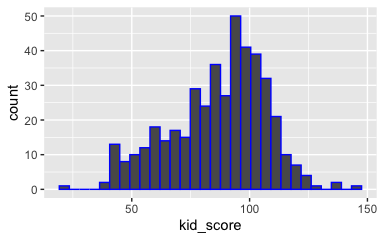
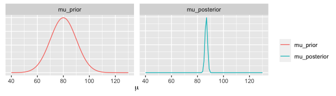
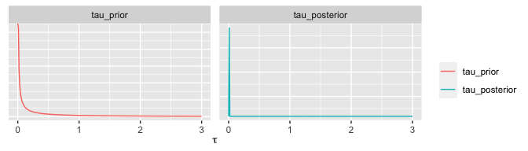

Bayesian Analysis - Single Parameter Normal Model
================
Dr Niamh Cahill (she/her)

## Example: Cognitive Test Scores

Data (y) are available on the cognitive test scores of three- and
four-year-old children in the USA. The sample contains 434 observations.

<!-- -->

## Normal distribution with known variance

We will assume a normal model for the data where
$y_i|\mu,\sigma^2 \sim N(\mu, \sigma^2)$. Assume $\sigma^2$ is known
where $\sigma = 20.4$

-   Specify the likelihood for $\mu$

$p(y|\mu, \sigma^2) = \prod_{i=1}^{n} \frac{1}{\sqrt {2\pi\sigma^2}}exp \bigg(-\frac{1}{2\sigma^2}(y_i - \mu)^2\bigg)$

-   Specify a prior for $\mu$

$\mu \sim N(\mu_0, \sigma^2_{_0})$

-   Use Bayes’ rule to obtain the posterior distribution

$p(\mu|y) \propto p(y|\mu)p(\mu)$

-   As it turns out, the posterior is also a normal distribution

$$\mu|y \sim N \bigg(\frac{n\bar{y}/\sigma^2 + \mu_0/\sigma^2_{0}}{n/\sigma^2 + 1/\sigma^2_{0}}, {\frac{1}{n/\sigma^2 + 1/\sigma^2_{0}}}\bigg)$$

## Prior vs Posterior for $\mu$

-   Choose prior mean and variance, e.g., $\mu_0 = 80$,
    $\sigma_{0} = 10$

<!-- -->

-   Result: $\hat{\mu} =$ 86.73, 95% CI: (84.82, 88.64)

## Normal distribution with known mean

-   Assume $\mu$ is known where $\mu = 86.79$

-   Usually work with precision i.e., $\tau = 1/\sigma^2$

-   Specify a prior for $\tau$

    -   Popular prior for the precision of a normal distribution is a
        gamma prior e.g., $\tau \sim Gamma(a, b)$ where
        $E[\tau] = \frac{a}{b}$ and $Var[\tau] = \frac{a}{b^2}$

    -   $p(\tau|a,b) = \frac{b^a}{\Gamma(a)}\tau^{a-1}e^{-b\tau}$ for
        $\tau >0$ and $a,b > 0$

-   Use Bayes’ rule to obtain the posterior distribution

$p(\tau|y) \propto p(y|\tau)p(\tau)$

-   The posterior will also be a gamma distribution

$\tau|y \sim Gamma \bigg(a + n/2, b + 1/2\sum_{i=1}^n (y_i - \mu)^2\bigg)$

## Prior vs Posterior for $\tau$

-   Choose parameter values for the prior distribution for $\tau$, e.g.,
    $a = 0.1$, $b = 0.1$

<!-- -->

-   Result: Through simulation from the posterior for $\sigma$ we find
    $\hat{\sigma} = 20.23$, 95% CI: (18.96, 21.63)
