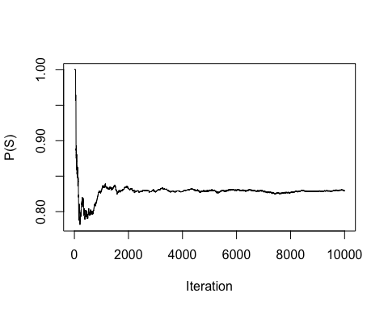
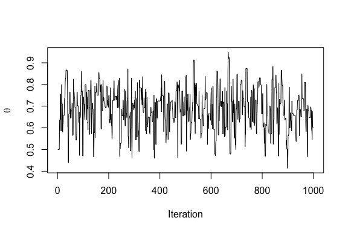

Bayesian Analysis
================
Dr Niamh Cahill (she/her)
Markov Chain Monte Carlo (MCMC) Sampling

## Markov Chain Monte Carlo (MCMC)

We’ve already discussed Monte Carlo sampling. Now we’re going to
consider Markov Chain Monte Carlo (MCMC) sampling. MCMC algorithms are
used for sampling from a target distribution

**Markov Chain**

-   Any process in which each step has no memory of states before the
    current state is call a (first-order) Markov process and a sucession
    of such steps is a Markov chain.

-   The stationary distribution of the Markov chain is the target
    distribution

Using MCMC we can construct a set of samples from an unknown target
distribution.

## Example

What is the probability of sunny (S) and rainy (R) weather given

$P(S_{t+1}|R_t) = 0.5$

$P(R_{t+1}|R_t) = 0.5$

$P(R_{t+1}|S_t) = 0.1$

$P(S_{t+1}|S_t) = 0.9$

Note the future state of the weather only depends on the current state.

## Stationary Distribution

As we progress through time, the probability of being in certain states
(e.g., rainy or sunny) are more likely than others. Over the long run,
the distribution will reach an equilibrium with an associated
probability of being in each state. This is known as the **Stationary
Distribution**.

The reason it is stationary is because if you apply the Transition
Matrix to this given distribution, the resultant distribution is the
same as before:

$$\pi = \pi P $$ Where $\pi$ is some distribution which is a row vector
with the number of columns equal to the states in the state space and
$P$ is the Transition Matrix.

## Example R code

``` r
# 0 = rainy, 1 = sunny
# initialize
W_current <- rbinom(1,1,0.5) 

# number of Monte Carlo Samples
n_samps <- 10

# save the samples
W_new <- rep(NA, n_samps)

# run the Markov Chain
for(i in 1:n_samps)
{
W_new[i] <- ifelse(W_current == 0,
       rbinom(1,1,0.5),
       rbinom(1,1,0.9))

W_current = W_new[i]
}

W_new
```

Based on the samples of $S$(coded as 1) and $R$(coded as 0) we can
estimate $P(S)$ and $P(R)$.

## Example continued

<!-- -->

After enough iterations (samples) $P(S) =$ 0.8294.

## Metropolis Algorithm

-   Suppose we have a target distribution $p(\theta|y)$ from which we
    would like to generate a representative sample.

-   Sample values from the target distribution can be generated by
    taking a random walk through the parameter space.

    0.  start at some arbitrary parameter value (initial value)

    1.  propose a move to a new value in the parameter space

    2.  calculate the acceptance ratio
        $r = min \bigg(1, \frac{ p(y|\theta_{pro})p(\theta_{pro})}{p(y|\theta_{cur})p(\theta_{cur})}\bigg)$

    3.  draw a random number, $u$ between 0 and 1. If $u < r$ then the
        move is accepted.

    4.  repeat until a representative sample from the target
        distribution has been generated (more on this later)

## Metropolis Algorithm for the Happiness example

Recall for the Happiness example:

-   Data: n = 20 women, y = 14 women reported being happy

$y \sim Binomial(n = 20, \theta)$

$\theta|a,b \sim Beta(a = 1 ,b = 1)$

0.  Let’s initialise using $\theta_{cur}$ = 0.5

1.  Propose a new move using a Normal proposal distribution such that
    $\theta_{pro} = \theta_{cur} + N(0,\sigma)$

2.  $r = \text{min} \bigg(1, \frac{ dbinom(y,n,\theta_{pro})dbeta(\theta_{pro},1,1)}{dbinom(y,n,\theta_{cur})dbeta(\theta_{cur},1,1)}\bigg)$

3.  Compare $u \sim Uniform(0,1)$ with $r$ and accept move if $u < r$

## Metropolis R code

``` r
# data 
y <- 14
N <- 20
# beta prior parameters
a <- 1
b <- 1
# number of samples to generate
n_iter <- 1000

# 0. 
theta_cur <- rep(NA, n_iter)
theta_cur[1] <- 0.5
sigma_pro <- 0.2

for(i in 1:(n_iter-1)){
# 1.
theta_pro <- theta_cur[i] + rnorm(1,0,sigma_pro)
# 2. 
if(theta_pro<0|theta_pro>1){r <- 0 } # set to zero if theta outside [0,1]
else {
  r <- 
min(1,dbinom(14,20,theta_pro)*dbeta(theta_pro,a,b)/
      dbinom(14,20,theta_cur[i])*dbeta(theta_cur[i],a,b))
  }
# 3. 
u <- runif(1,0,1)
accept <- u < r
theta_cur[i+1]<- ifelse(accept,theta_pro,theta_cur[i])
} # end i loop
```

## Trace Plot for $\theta$

-   Traceplots provide a visual tool for monitoring convergence towards
    a target distribution (i.e., the posterior)

-   In general we look for a stationary plot where the sample values
    display a random scatter around a mean value.

<!-- -->

## Metropolis Algorithm for the Kid IQ example

Recall that data (y) are available on the cognitive test scores of
three- and four-year-old children in the USA. The sample contains 434
observations.

$y_i|\mu,\sigma^2 \sim N(\mu, \sigma^2)$. Assume $\sigma^2$ is known
where $\sigma = 20.4$

$\mu|\mu_0,\sigma_0 \sim N(\mu_0 = 80, \sigma^2_{_0} = 10^2)$

0.  Let’s initialise using $\mu_{cur}$ = 80

1.  Propose a new move using a Normal proposal distribution such that
    $\mu_{pro} = \mu_{cur} + N(0,1)$

2.  Calculate the acceptance ratio on the log scale (avoids numerical
    instability)

$log(r) = \text{min}(0, \sum_i log(dnorm(y_i,\mu_{pro},20.4)) + log(dnorm(\mu_{pro},80,10))$
$- \sum_i log(dnorm(y_i,\mu_{cur},20.4)) - log(dnorm(\mu_{cur},80,10)))$

3.  Compare $u \sim Uniform(0,1)$ with $r$ and accept move if
    $log(u) < r$

**Task:** Code this in R and produce a trace plot for $\mu$

## Bayesian Inference for $\mu$ and $\sigma$ (the Kid IQ example)

-   It is more realistic to assume $\mu$ and $\sigma$ are unknown

-   In this case we need priors for both parameters

-   Then from Bayes’ rule we can get the joint posterior
    $p(\mu, \sigma |y) \propto p(y|\mu, \sigma)p(\mu,\sigma)$

-   Problem: most choices of prior will not result in a closed from
    expression for the posterior.

-   Solution: If we can sample from the target (posterior) distribution
    we can still do inference.

-   The Metropolis method is very useful but can be inefficient. Another
    sampling method that’s often used for models with multiple
    parameters is **Gibbs sampling**

## The Gibbs Sampler

We can use Gibbs Sampling when we can sample directly from the
conditional posterior distributions for each model parameter.

So instead of trying to sample directly from a joint posterior
distribution, we sample parameters sequentially from their complete
conditional distributions (conditioning on data as well as all other
model parameters).

0.  Assign initial values to the parameters $\mu^{(0)}$ and $\tau^{(0)}$

1.  for the normal data, given starting values $\mu^{(0)}$ and
    $\tau^{(0)}$, draw samples s = 2, 3,….,\`some large number’ as
    follows:

    1.1. sample $\mu^{(s+1)}$ from $p(\mu|y,\tau^{(s)})$

    1.2. sample $\tau^{(s+1)}$ from $p(\tau|y,\mu^{(s+1)})$.

2.  Repeat and this will (eventually) generate samples from
    $p(\mu,\sigma|y)$, which is what we want!

## Complete conditional distributions

Recall for the Normal likelihood
$y_i|\mu,\sigma^2 \sim N(\mu, \sigma^2)$ where $\sigma$ is known and a
Normal prior $\mu \sim N(\mu_0, \sigma^2_{_0})$, we get a posterior for
$\mu$ that is also a normal distribution (i.e., we used a conjugate
prior)

$$\mu|y \sim N \bigg(\frac{\mu_0/\sigma^2_{0}+ n\bar{y}/\sigma^2}{1/\sigma^2_{0}+n/\sigma^2}, {\frac{1}{1/\sigma^2_{0}+n/\sigma^2}}\bigg)$$

Recall for the Normal likelihood
$y_i|\mu,\sigma^2 \sim N(\mu, \sigma^2)$ where $\mu$ is known and a
Gamma prior $\frac{1}{\sigma^2} = \tau \sim Gamma(a, b)$ we get a
posterior for $\tau$ that will also be a gamma distribution

$$\tau|y \sim Gamma \bigg(a + n/2, b + 1/2\sum_{i=1}^n (y_i - \mu)^2\bigg)$$

These are the **complete conditionals**. We know the posterior
distribution for one parameter conditional on knowning the other
parameter(s). Now we can use Gibbs sampling.

## Gibbs sampling R code

``` r
## Data
y <- kidiq$kid_score
n <- length(y)

## Prior parameters 
# for gamma prior (for tau)
a <- 0.1
b <- 0.1
# for normal prior (for mu)
mu0 <- 80
sigma.mu0 <- 10
## choose # iter
n_iter <- 10000
## create objects to store results
mu_s <- tau_s <- sd_s <- rep(NA, n_iter)
## Initialise 
mu_init <- 80
tau_init <- 1
## define parameters for gamma posterior on tau
post.a = a + n/2
post.b = 1/2*(sum((y-mu_init)^2))

for(s in 1:n_iter){
## sample from complete conditional for tau
tau_s[s] <- rgamma(1,post.a,post.b)
sd_s[s] <- sqrt(1/tau_s[s]) # transform to sigma
## update posterior parameters for mu
mupost.mean = (mu0/(sigma.mu0^2) + tau_s[s]*n*mean(y))/(1/(sigma.mu0^2) + tau_s[s]*n)
mupost.sd = sqrt(1/(1/(sigma.mu0^2)+tau_s[s]*n))
## sample from complete conditional for mu
mu_s[s] <- rnorm(1,mupost.mean,mupost.sd)
## update posterior parameters for tau
post.a = a + n/2
post.b = b + 1/2*(sum((y-mu_s[s])^2))
} # end s loop
```
