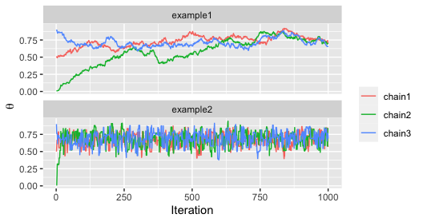
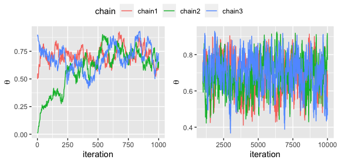
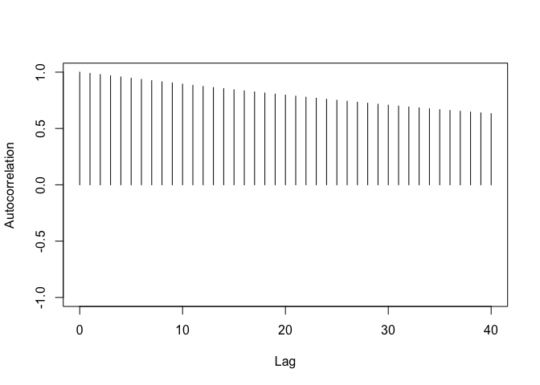
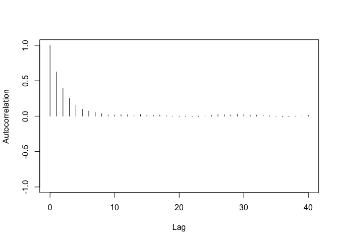

Bayesian Analysis - Markov Chain Monte Carlo (MCMC) Diagnostics
================
Dr Niamh Cahill (she/her)


## MCMC Reprentativeness, Accuracy and Efficiency

We have 3 main goals in generating an MCMC sample from the target
(posterior) distribution.

1.  The values must be representative of the posterior distribution.
    They shouldn’t be influenced by the initial values of the chain.
    They should explore the full range of the parameter space.

2.  The chain should be a sufficient size so that estimates are accurate
    and stable. Estimates and uncertainty intervals should not be much
    different if the MCMC is run again.

3.  The chain should be generated as efficiently as possible.

We cannot run chains for an infinitely long time so we must check the
quality based on a set of finite samples from the chain.

We use a set of convergence diagnostics to check the quality.

## Checking Trace Plots

The first method to detect convergence (or a lack thereof) is a visual
examination of the MCMC chains.

A graph of the sampled parameter values as a function of the MCMC step
is called a *trace plot*. Here’s some examples. Which one do you think
is indicating convergence?

<!-- -->

## MCMC diagnostics: burn-in

The initial phase of an MCMC chain is called the burn-in phase, during
which the chain converges towards the target distribution.

-   Samples from the burn-in period should be discarded.

-   The trace plots can be used to detect burn-in.

<!-- -->

## MCMC diagnostics: Potential Scale Reduction Factor ($\hat{R}$)

A popular numerical check for convergence is a measure of how much
variance there is between chains relative to how much variance there is
within chains.

-   The idea is, that if all chains have settled into a converged state
    with representative sampling from the posterior, then the average
    difference between the chains should be the same as the average
    difference (across steps) within the chain.

-   This is called the Brooks-Gelman-Rubin statistic or the “potential
    scale reduction factor” or the $\hat{R}$.

-   The optimal value is 1. Usually 1.1 is used as a cutoff for flagging
    convergence issues.

## MCMC diagnostics: Autocorrelation

-   Mont Carlo samples are direct/random/independent draws from a target
    distribution.

-   MCMC samples are NOT independent draws from a target distribution,
    because:

    1.  The first draw is set by the user and thus not a random draw
        from the target distribution.
    2.  Subsequently, draw $s+1$ depends on draw $s$ - samples are
        autocorrelated

However, we would like some measure of how much independent information
there is in the autocorrelated chains.

## MCMC diagnostics: Autocorrelation

We can use autocorrelation function (ACF) plots to help us diagnose
autocorrelation issues.

<!-- -->

## MCMC diagnostics: Autocorrelation

We can use autocorrelation function (ACF) plots to help us diagnose
autocorrelation issues.

<!-- -->

## MCMC diagnostics: effective sample size (ESS)

We want to know what the sample size of a non-autocorrelated chain, that
yields the same information, would be. An answer to this question can be
provided with a measure called *effective sample size (ESS)*

The effective sample size (ESS) divides the actual sample size by the
amount of autocorrelation.

$$ESS = \frac{N}{1 + 2\sum_{k=1}^\infty\rho_k}$$

where $\rho_k$ is the autocorrelation of the chain at lag $k$. A good
rule of thumb for the ESS is for it to be 10% of the total number of
samples.

## MCMC diagnostics: Monte Carlo Standard Error (MCSE)

Another useful measure for the effective accuracy of the chain is the
Monte Carlo standard error (MCSE).

-   The standard deviation (SD) of the sample mean accross many
    replications is called the standard error and is estimated as SE =
    SD/$\sqrt{N}$

-   So as the sample size $N$ increases the SE decreases. In other words
    the bigger the sample, the more precise the estimate.

Extending this to MCMC chains, we substitute the sample size N with the
ESS to get

MCSE = SD/$\sqrt{\text{ESS}}$

where SD is the standard deviation of the chain.

## MCMC efficiency

There are a number of ways to attempt to improve efficiency in the MCMC
process

1.  Run chains in parallel

2.  Adjust the sampling algorithm e.g., use Gibbs instead of Metropolis

3.  Change model parameterisation (e.g., mean center the data for
    regression analysis)

Let’s look at a demo of some of the diagnostics we’ve been discussing.

``` r
shinystan::launch_shinystan_demo()
```


## Diagnostics R code

``` r
library(tidyverse)
library(rstanarm)
library(coda)

## function for metropolis MCMC (Happiness example)
mcmc_theta <- function(sigma_pro = 0.01,
                       n_iter = 1000,
                       a = 1,
                       b = 1,
                       y = 14, 
                       n = 20)
{
  # 0. 
  theta_cur <- array(NA, c(n_iter,3))
  theta_cur[1,1] <- runif(1,0,1)
  theta_cur[1,2] <- runif(1,0,1)
  theta_cur[1,3] <- runif(1,0,1)
  
  for(j in 1:3)
  {
    for(i in 1:(n_iter-1))
    {
      # 1.
      theta_pro <- theta_cur[i,j] + rnorm(1,0,sigma_pro)
      
      # 2. 
      if(theta_pro<0|theta_pro>1){  r <- 0 }# set to zero if theta outside [0,1]
      else{
        r <- 
          min(1,dbinom(y,n,theta_pro)*dbeta(theta_pro,a,b)/
                (dbinom(y,n,theta_cur[i,j])*dbeta(theta_cur[i,j],a,b)))
      }
      
      # 3. 
      u <- runif(1,0,1)
      accept <- u < r
      theta_cur[i+1,j]<- ifelse(accept,theta_pro,theta_cur[i,j])
      
    }
  }
  
  theta_samps <- as_tibble(theta_cur)
  names(theta_samps) <- paste0("chain",1:3)
  theta_samps$iter <- 1:n_iter
  
  return(theta_samps)
}


# Trace plots -------------------------------------------------------------


theta_samps <- mcmc_theta(n_iter = 1000,
                          sigma_pro = 0.1)

theta_samps_long <- theta_samps %>% pivot_longer(-iter,
                                            names_to = "chain",
                                            values_to = "theta")

ggplot(theta_samps_long, aes(x = iter,y = theta)) +
  geom_line(aes(colour = chain)) +
  xlab("Iteration") +
  ylab(expression(theta)) +
  labs(colour = "")


# Rhat --------------------------------------------------------------------

mcmc_list <- mcmc.list(as.mcmc(theta_samps_long %>% filter(chain == "chain1") %>% select(theta)),
                       as.mcmc(theta_samps_long %>% filter(chain == "chain2") %>% select(theta)),
                       as.mcmc(theta_samps_long %>% filter(chain == "chain3") %>% select(theta)))
rhat <- gelman.diag(mcmc_list)
rhat

# ACF ---------------------------------------------------------------------

theta.mcmc <- as.mcmc(theta_samps)
autocorr.plot(theta.mcmc[,1])

# ESS ---------------------------------------------------------------------

effectiveSize(mcmc_list)

```

