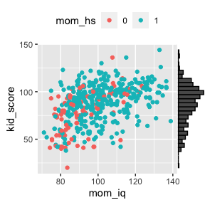
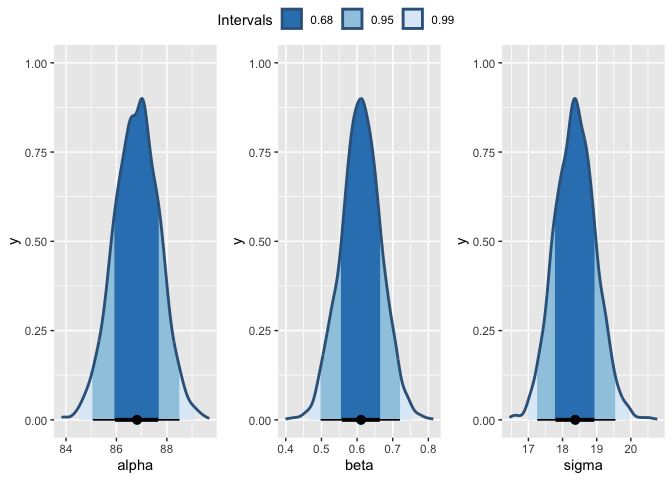
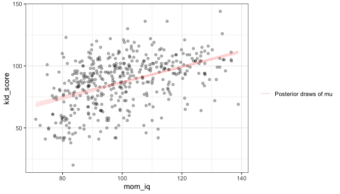
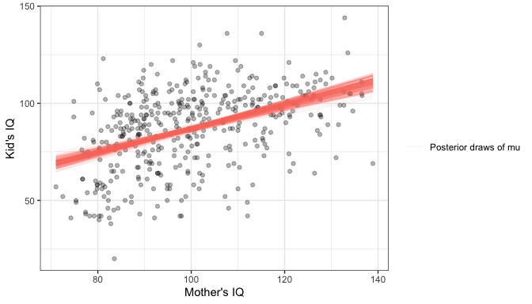
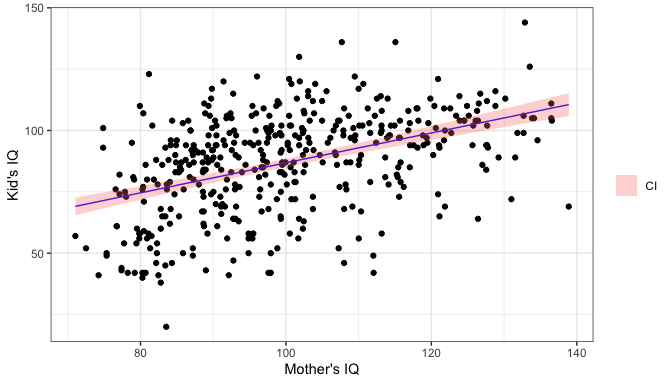
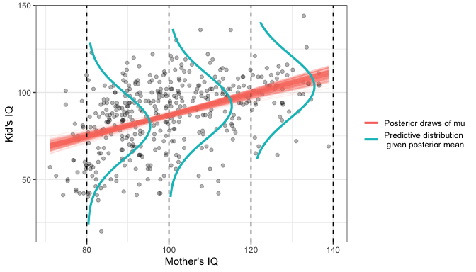
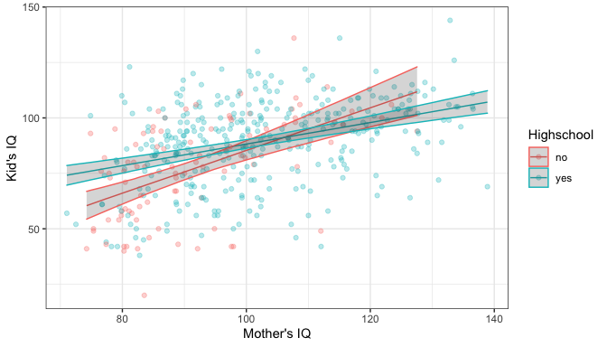
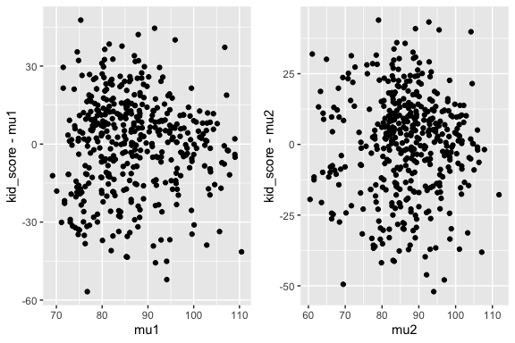
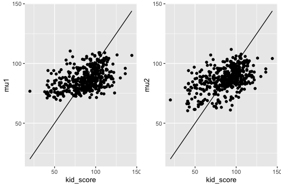

Bayesian Data Analysis - Bayesian Linear Regression with JAGS

================
Dr Niamh Cahill (she/her)

## Data: Cognitive Test Scores

Data are available on the cognitive test scores of three- and
four-year-old children in the USA. - The sample contains 434
observations - Information also provided about his/her mother’s IQ and
whether or not the mother graduated from highschool.

<!-- -->

## Simple Linear Regression Model

We will assume a normal model for the data such that

$y_i|\mu,\sigma^2 \sim N(\mu_i, \sigma^2)$

Let’s start simple and consider the expected value for $y_i$ as a
function of one explanatory variable (mother’s IQ) such that

$\mu_i = \alpha + \beta(x_i - {\text mean}(x_i))$

where the predictor is mean centered.

This could also be specified as

$y_i = \alpha + \beta(x_{i} - {\text mean}(x_{i})) + \epsilon_i$

$\epsilon_i \sim N(0, \sigma^2)$

## Prior Choice

We will need to specify priors for $\alpha$, $\beta$ and $\sigma$.

Before seeing the data would could assume that the value of the
intercept ($\alpha$) is unlikely to be to beyond the range of possible
IQ values (1, 200). So let’s assume an expected value of 100 and a
standard deviation of 30.

$\alpha \sim N(100,30^2)$

For the slope ($\beta$), before seeing the data I have no idea about
whether the mother’s IQ affects the kid’s IQ, so it is reasonable to
consider a value of 0 for the slope. Realistically I think we are
unlikely to see the value of the slope going anywhere beyond the range
(-4,4), so let’s assume a standard deviation for the slope of 2.

$\beta \sim N(0,2^2)$

## Prior Choice

For $\sigma$ we can consider some uninformative or weakly informative
priors commonly used for variance parameters:

-   Gamma prior $gamma(\epsilon, \epsilon)$ on the precision
    ($\tau = \frac{1}{\sigma^2}$)

$\tau \sim Ga(0.1,0.1)$

-   Uniform prior on the standard deviation

$\sigma \sim U(0,50)$

-   Cauchy (half-t) prior on the standard deviation

$\sigma \sim ht(30,10^2,1)$

## JAGS model specification

``` r
lrmodel1 ="
model{
    for (i in 1:n){
        y.i[i] ~ dnorm(mu.i[i], sigma^-2)
        mu.i[i] <- alpha + beta*(x.i[i] - mean(x.i))
    }

#Priors
alpha ~ dnorm(80, 30^-2) 
beta ~ dnorm(0, 2^-2) 
sigma ~ dt(30,10^-2,1)T(0,) #truncated t-distribution
}
"
```

## Model Fitting

``` r
library(rjags)
library(R2jags)

jags.data <- list(y.i = kidiq$kid_score, 
                  x.i = kidiq$mom_iq, 
                  n = nrow(kidiq))

parnames <- c("alpha","beta","sigma","mu.i")

mod1 <- jags(data = jags.data, 
            parameters.to.save=parnames, 
            model.file = textConnection(lrmodel1))
```

    ## Compiling model graph
    ##    Resolving undeclared variables
    ##    Allocating nodes
    ## Graph information:
    ##    Observed stochastic nodes: 434
    ##    Unobserved stochastic nodes: 3
    ##    Total graph size: 1881
    ## 
    ## Initializing model

## Output - Parameter Uncertainty

``` r
m1 <- mod1$BUGSoutput$sims.matrix

par_samps <- m1 %>% spread_draws(alpha,beta,sigma) 

par_summary <- m1 %>% 
                gather_rvars(alpha,beta,sigma) %>% 
                median_qi(.value)
par_summary
```

    ## # A tibble: 3 × 7
    ##   .variable .value .lower .upper .width .point .interval
    ##   <chr>      <dbl>  <dbl>  <dbl>  <dbl> <chr>  <chr>    
    ## 1 alpha     86.8   85.1   88.5     0.95 median qi       
    ## 2 beta       0.611  0.498  0.720   0.95 median qi       
    ## 3 sigma     18.4   17.3   19.5     0.95 median qi

## Output - Parameter Uncertainty

<!-- -->

## Output - Parameter Uncertainty

``` r
mu_ind <- 1:nrow(kidiq)
mu_samps <- m1 %>% spread_draws(mu.i[mu_ind]) 
mu_summary <- mu_samps %>% 
                median_qi(.width = 0.95)
mu_summary[1:5,]
```

    ## # A tibble: 5 × 7
    ##   mu_ind  mu.i .lower .upper .width .point .interval
    ##    <int> <dbl>  <dbl>  <dbl>  <dbl> <chr>  <chr>    
    ## 1      1  99.7   96.7  103.    0.95 median qi       
    ## 2      2  80.3   78.2   82.4   0.95 median qi       
    ## 3      3  96.2   93.7   98.6   0.95 median qi       
    ## 4      4  86.5   84.7   88.2   0.95 median qi       
    ## 5      5  82.4   80.5   84.3   0.95 median qi

## Posterior Draws of $\mu_i$

For each draw (simulation) $s= 1, \ldots , S$ of the parameters from the
posterior distribution we can obtain
$\mu_i^{(s)} = \beta_0^{(s)} + \beta_1^{(s)}(x_{i} - {\text mean}(x_i))$

**5 draws**

<!-- -->

## Posterior Draws of $\mu_i$

For each draw (simulation) $s= 1, \ldots , S$ of the parameters from the
posterior distribution we can obtain
$\mu_i^{(s)} = \beta_0^{(s)} + \beta_1^{(s)}(x_{i} - {\text mean}(x_i))$

**200 draws** <!-- -->

## Point Estimate + Credible Interval

<!-- -->

## Predictive Distribution

The posterior predictive distribution is the distribution of possible
unobserved values conditional on the observed values.

<!-- -->

## Credible interval vs prediction interval

A Bayesian “credible interval”, is an interval associated with the
posterior distribution of a parameter, for example, the of the Kid’s IQ
given a mother’s IQ of 120 ($\mu$). If I give an 80% interval there
should be an 80% chance that the expected value of the Kid IQ lies
within the interval.

A prediction interval is an interval associated with a random variable
yet to be observed, for example, an Kid’s IQ, given a mother’s IQ of 120
($\tilde{y})$. If I give an 80% interval there should be an 80% chance
that the actual Kid IQ lies within the interval.

``` r
lrmodel1 ="
model{
....
## predictive distribution
  mu_pred <- alpha + beta*(120 - mean(x.i))
    ytilde ~ dnorm(mu_pred, sigma^-2)
}
"
```

## Credible interval vs prediction interval

Let’s consider the difference between the credible interval and the
prediction interval for the Kid’s IQ when the Mother’s IQ = 120.

``` r
m1 <- mod1$BUGSoutput$sims.matrix

par_samps <- m1 %>% spread_draws(mu_pred,ytilde) 

par_summary <- m1 %>% 
                gather_rvars(mu_pred,ytilde) %>% 
                median_qi(.value)
par_summary
```

    ## # A tibble: 2 × 7
    ##   .variable .value .lower .upper .width .point .interval
    ##   <chr>      <dbl>  <dbl>  <dbl>  <dbl> <chr>  <chr>    
    ## 1 mu_pred     99.0   96.0   102.   0.95 median qi       
    ## 2 ytilde      99.6   62.2   135.   0.95 median qi

What do you notice about the width of the intervals?

## Extending the regression model

Suppose now we want to see if there’s a “highschool” effect on the
relationship between Mother’s IQ and Kid’s IQ.

Some possible choices:

-   Model 2A: Add the highschool variable in as a covariate, this will
    lead to a varying intercepts model with $\alpha_1$ for highschool =
    no and $\alpha_2$ for highschool = yes.

-   Model 2B: Add the highschool variable in as a covariate and as an
    interaction with Mother’s IQ, this will lead to a varying intercepts
    and slopes model with $\alpha_1$ and $\beta_1$ for highscool = no
    and $\alpha_2$ and $\beta_2$ for highscool = yes.

Let’s consider model 2B. The specification of this model could be
written as

$y_i|\mu,\sigma^2 \sim N(\mu_i, \sigma^2)$

$\mu_i = \underset{\text{j[i] = HS for obs i}}{\alpha_{j[i]} + \beta_{j[i]}}(x_{i} - {\text mean}(x_i))$

$\alpha_j \sim N(100,30^2), \hspace{0.5em} \text{for } j=1,2$

$\beta_j \sim N(0,2^2), \hspace{0.5em} \text{for } j=1,2$

## JAGS model specification

``` r
lrmodel2 ="
model{
    for (i in 1:n){
        y.i[i] ~ dnorm(mu.i[i], sigma^-2)
        mu.i[i] <- alpha.j[hs_index[i]] + beta.j[hs_index[i]]*(x.i[i] - mean(x.i))
    }

#Priors
for(j in 1:m)
{
alpha.j[j] ~ dnorm(80, 30^-2) 
beta.j[j] ~ dnorm(0, 2^-2) 
}
sigma ~ dt(30,10^-2,1)T(0,) #truncated t-distribution
}
"
```

``` r
jags.data <- list(y.i = kidiq$kid_score, 
                  x.i = kidiq$mom_iq, 
                  hs_index = as.numeric(kidiq$mom_hs + 1),
                  n = nrow(kidiq),
                  m = 2)
```

## Output

``` r
m2 <- mod2$BUGSoutput$sims.matrix

par_samps <- m2 %>% spread_draws(alpha.j[1:2],beta.j[1:2]) 

par_summary <- m2 %>% 
                gather_rvars(alpha.j[1:2],beta.j[1:2]) %>% 
                median_qi(.value)
par_summary
```

    ## # A tibble: 4 × 8
    ##   `1:2` .variable .value .lower .upper .width .point .interval
    ##   <int> <chr>      <dbl>  <dbl>  <dbl>  <dbl> <chr>  <chr>    
    ## 1     1 alpha.j   85.3   81.1   89.7     0.95 median qi       
    ## 2     2 alpha.j   88.2   86.3   90.2     0.95 median qi       
    ## 3     1 beta.j     0.964  0.672  1.25    0.95 median qi       
    ## 4     2 beta.j     0.486  0.359  0.617   0.95 median qi

## Visualising the results

<!-- -->

## Which model do we choose?

Firstly, let’s have a look at the residuals for each model

<!-- -->

## Which model do we choose?

Let’s also consider the observed values vs the model-based estimates.

<!-- -->

## Model information criteria

You might have come across these before: Akaike Information Criterion
(AIC), Bayesian Information Criterion (BIC)

-   The general idea is that the score on the likelihood is a good
    measure of model fit, except for the fact that more complex models
    will generally have higher likelihood scores

-   If we penalise these scores by some measure of the complexity of the
    model then we can compare models across complexities

-   The usual measure of complexity is some function of the number of
    parameters

-   Because these are relative model comparisons, the best model
    according to an IC might still be useless.

## Model information criteria

To calculate an IC, the likelihood score gets transformed into the
deviance (remember JAGS monitors the “deviance” parameter), which is
minus twice the log-likelihood score and then add a model complexity
term is added.

-   The two most common ICs are:

AIC : -2 log $\hat{L}$ + 2p

BIC : -2 log $\hat{L}$ + p log(n)

where p is the number of parameters and n is the number of observations

-   Smaller values indicate the preferred model.

## Model information criteria

For Bayesian models it’s hard to know which value of L to use, seeing as
at each iteration we get a different likelihood score. Two specific
versions of IC have been developed.

-   The first, called the Deviance Information Criteria (DIC) is
    calculated via:

DIC: -2 log $p(y|\hat{\theta}) + 2 p_D$

where $p_D$ = 2(log $p(y|\hat{\theta})$ $- E_{post}$log $p(y|\theta))$
is the effective number of parameters

-   The second called the Widely Applicable Information Criterion (WAIC)
    which is calculated as:

WAIC: -2 log $p(y|\hat{\theta}) + p_{WAIC}$

Here $p_{WAIC}$ is a measure of the variability of the likelihood scores

## Which IC to use?

-   WAIC and DIC are built for Bayesian hierarchical models

-   DIC is included by default in the R2jags package

-   WAIC is included in the loo package which is installed alongside
    Stan

-   WAIC is considered superior as it also provides uncertainties on the
    values. Most of the others just give a single value

## Obtaining DIC and WAIC from JAGS

-   DIC is easy to obtain from JAGS

``` r
DIC.m1 = mod1$BUGSoutput$DIC
DIC.m1
```

    ## [1] 3757.68

``` r
DIC.m2 = mod2$BUGSoutput$DIC
DIC.m2
```

    ## [1] 3745.043

-   WAIC takes a little bit more work but there’s some code
    [here](https://gist.github.com/oliviergimenez/68ad17910a62635ff6a062f8ec34292f#file-compute-waic-in-jags-r)
    that illustrates how to do it.

<!-- -->

    ##   waic p_waic 
    ## 3757.1    2.9

    ##   waic p_waic 
    ## 3745.1    4.9

## Cross Validation

Cross validation (CV) works by:

1.  Removing part of the data

2.  Fitting the model to the remaining part

3.  Predicting the values of the removed part

4.  Comparing the predictions with the true (left-out) values

It’s often fitted repeatedly

-   as in k-fold CV where the data are divided up into k groups, and
    each group is left out in turn.

-   In smaller data sets, people perform leave-one-out cross-validation
    (LOO-CV)


## R Code for Regression in JAGS

```{r}
library(tidybayes)
library(tidyverse)
library(rjags)
library(R2jags)

library(rstanarm)
data(kidiq)

## Model spec
lrmodel1 ="
model{

for(i in 1:N)
{
# data model 
y.i[i] ~ dnorm(mu.i[i], sigma^-2)
mu.i[i] <- alpha + beta*(x.i[i] - mean(x.i))
}

# priors 

alpha ~ dunif(0,200)
beta ~ dnorm(0,2^-2)
sigma ~ dt(30,10^-2,1)T(0,)

}
"
## data and parameters
jags.data <- list(y.i = kidiq$kid_score,
                  x.i = kidiq$mom_iq,
                  N = nrow(kidiq))

parnames <- c("alpha","beta","mu.i","sigma")

## run JAGS
mod1 <- jags(data = jags.data, 
             parameters.to.save=parnames, 
             model.file = textConnection(lrmodel1),
             n.iter = 5000,
             n.burnin = 1000,
             n.thin = 4)

## Output
plot(mod1)
mod1$BUGSoutput$summary # summary

## you can pull samples from jags output object
plot(density(mod1$BUGSoutput$sims.list$alpha))
quantile(mod1$BUGSoutput$sims.list$alpha,probs = c(0.025, 0.5,0.95,0.975))

## note the dimension associated with mu.i
mod1$BUGSoutput$sims.list$mu.i %>% dim()

## regression parameters using tidybayes
m1 <- mod1$BUGSoutput$sims.matrix # needs matrix format of samples

## look at samples for individual parameters (similar to simslist but puts it in a tibble)
par_samps1 <- m1 %>% spread_draws(alpha,beta) 
plot(density(par_samps1$alpha))
plot(density(par_samps1$beta))

## summary for parameters
par_summary1 <- m1 %>% 
  gather_rvars(alpha, beta) %>% 
  median_qi(.value, .width = c(.95,0.9))
par_summary1

## expected value/model fit
mu_ind <- 1:nrow(kidiq)
mu_samps1 <- m1 %>% spread_draws(mu.i[mu_ind])

mu_summary1 <- mu_samps1 %>% 
  median_qi(.width = 0.95)
mu_summary1[1:5,]

## Plot fit + CI 
# add the model results to the dataset
kidiq_mod1 <- kidiq %>% mutate(mu.i = mu_summary1$mu.i,
                               lower = mu_summary1$.lower,
                               upper = mu_summary1$.upper)
# plot data and fit
ggplot(kidiq_mod1, aes(x = mom_iq, y = kid_score)) +
  geom_point(alpha = 0.5) +
  geom_line(aes(x = mom_iq, y = mu.i),colour = "blue") +
  geom_ribbon(aes(ymin = lower, ymax = upper, fill = "CI"), alpha = 0.5) +
  theme_bw() +
  labs(fill = "") +
  ylab("Kid's IQ") +
  xlab("Mother's IQ")


# Add group variable  -----------------------------------------------------


## Model spec
lrmodel2 ="
model{

for(i in 1:N)
{
# data model 
y.i[i] ~ dnorm(mu.i[i], sigma^-2)
mu.i[i] <- alpha.j[hs_index[i]] + beta.j[hs_index[i]]*(x.i[i] - mean(x.i))
}

# priors 

for(j in 1:M)
{
alpha.j[j] ~ dunif(0,200)
beta.j[j] ~ dnorm(0,2^-2)
}
sigma ~ dt(30,10^-2,1)T(0,)

}
"


## data and parameters
jags.data <- list(y.i = kidiq$kid_score,
                  x.i = kidiq$mom_iq,
                  N = nrow(kidiq),
                  M = 2,
                  hs_index = kidiq$mom_hs + 1)

parnames <- c("alpha.j","beta.j","mu.i","sigma")

## run JAGS
mod2 <- jags(data = jags.data, 
             parameters.to.save=parnames, 
             model.file = textConnection(lrmodel2),
             n.iter = 5000,
             n.burnin = 1000,
             n.thin = 4)

## Output
plot(mod2)
mod2$BUGSoutput$summary # summary


## regression parameters using tidybayes
m2 <- mod2$BUGSoutput$sims.matrix # needs matrix format of samples


## look at samples for individual parameters (similar to simslist but puts it in a tibble)
par_samps2 <- m2 %>% spread_draws(alpha.j[1:2],beta.j[1:2]) 


## summary for parameters
par_summary2 <- m2 %>% 
  gather_rvars(alpha.j[1:2], beta.j[1:2]) %>% 
  median_qi(.value, .width = c(.95,0.9))
par_summary2

## expected value/model fit
mu_ind <- 1:nrow(kidiq)
mu_samps2 <- m2 %>% spread_draws(mu.i[mu_ind])

mu_summary2 <- mu_samps2 %>% 
  median_qi(.width = 0.95)
mu_summary2[1:5,]

## Plot fit + CI 
# add the model results to the dataset
kidiq_mod2 <- kidiq %>% mutate(mu.i = mu_summary2$mu.i,
                               lower = mu_summary2$.lower,
                               upper = mu_summary2$.upper,
                               mom_hs = factor(mom_hs, labels = c("no","yes")))
# plot data and fit
ggplot(kidiq_mod2, aes(x = mom_iq, y = kid_score)) +
  geom_point(alpha = 0.5) +
  geom_line(aes(x = mom_iq, y = mu.i, colour = mom_hs)) +
  geom_ribbon(aes(ymin = lower, ymax = upper, fill = mom_hs), alpha = 0.5) +
  theme_bw() +
  labs(fill = "") +
  ylab("Kid's IQ") +
  xlab("Mother's IQ")
```
