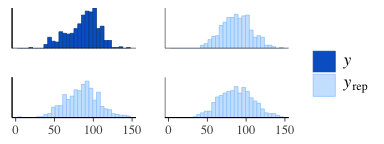
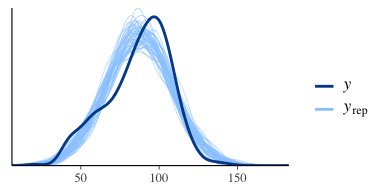
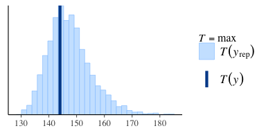
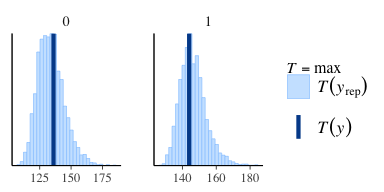
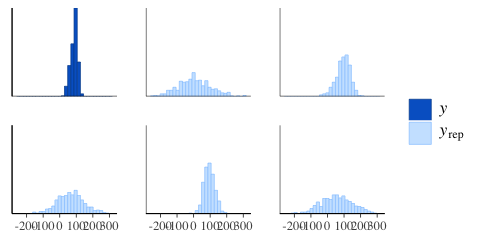
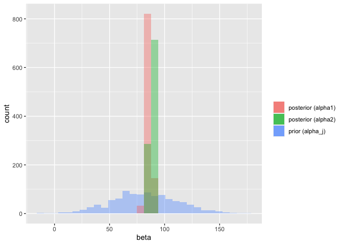
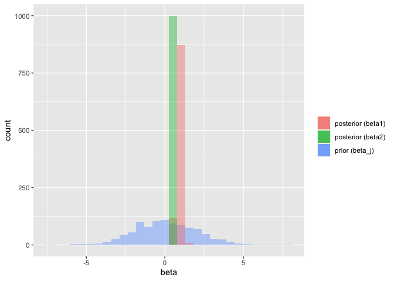

Bayesian Data Analysis
================
Dr Niamh Cahill (she/her)
Model Checking

## Posterior Predictive Checking

The idea behind posterior predictive checking is simple: if a model is a
good fit then we should be able to use it to generate data that looks a
lot like the data we observed.

To generate the data used for posterior predictive checks (PPCs) we
simulate from the posterior predictive distribution.

For each draw (simulation) $s= 1, \ldots , S$ of the parameters from the
posterior distribution, we draw an entire vector of $N$ outcomes
$\tilde{y}^{(s)}$ from the posterior predictive distribution by
simulation from the data model, conditional on parameters.

The result is an $S \times N$ matrix of draws $\tilde{y}$

When simulating from the posterior predictive distribution using the
same values of the predictors X that we used when fitting the model we
denote the simulations $y^{rep}$.

When predicting new or future observations we denote the simulations
$\tilde{y}$.

We will use the `bayesplot` package to create various graphical displays
for posterior predictive checks (PPCs).

## Posterior Predictive Checking

Let’s consider again the model for Kid IQ

$y_i \sim N(\mu_i,\sigma)$

$\mu_i = \underset{\text{j[i] = HS for obs i}}{\alpha_{j[i]} + \beta_{j[i]}}(x_{i} - {\text mean}(x_i))$

$\alpha_j \sim N(100,30^2), \hspace{0.5em} \text{for } j=1,2$

$\beta_j \sim N(0,2^2), \hspace{0.5em} \text{for } j=1,2$

We can generate “replicates” of this dataset ($y^{rep}$) from the
specified model

-   draw $\mu_i^{(s)}$ and $\sigma^{(s)}$ from the posterior
    $p(\mu,\sigma|y)$

-   draw $y_{i}^{rep(s)}$ from $N(\mu_i^{(s)},\sigma^{(s)})$

## JAGS model to include $y^{rep}$

``` r
lrmodel2 ="
model{
    for (i in 1:n){
        y.i[i] ~ dnorm(mu.i[i], sigma^-2)
        mu.i[i] <- alpha.j[hs_index[i]] + beta.j[hs_index[i]]*(x.i[i] - mean(x.i))
    }

#Priors
for(j in 1:m)
{
alpha.j[j] ~ dnorm(80, 30^-2) 
beta.j[j] ~ dnorm(0, 2^-2) 
}
sigma ~ dt(30,10^-2,1)T(0,) #truncated t-distribution

## predictive distribution
for (i in 1:n) {yrep[i] ~ dnorm(mu.i[i], sigma^-2)}
}
"
```

## Posterior predictive checking

To use the PPC function from the `bayesplot` package we need the outcome
values `y` and a matrix of replicates `yrep`

``` r
y <- kidiq$kid_score
yrep <- mod$BUGSoutput$sims.list$yrep
```

Now let’s look at histograms of some of the `yrep` datasets and see how
they compare to `y`

``` r
library(bayesplot)
color_scheme_set("brightblue")
ppc_hist(y, yrep[1:3, ])
```

<!-- -->

## Posterior predictive checking

We can also look at is a comparison of the distribution of y and the
distributions of some of the simulated datasets in the `yrep` matrix via
density plots.

``` r
ppc_dens_overlay(y, yrep[1:50, ])
```

<!-- -->

## Posterior predictive checking with test statistic

Decide on a test quantity (min, max) $T(y,\theta)$. A good statistic
would ideally be independent of the parameters of the model.

-   obtain the summary quantity for the observed data $T(y)$

-   obtain the summary quantity for the replicated data $T(y,\theta)$

Let’s consider the maximum Kid IQ score as the test quantity

``` r
max_y <- max(kidiq$kid_score)
ppc_stat(y,yrep, stat = "max")
```

<!-- -->

## Posterior predictive checking with test statistic

Many of the available PPCs can also be carried out within levels of a
grouping variable.

For example we can compute the test statistic within levels of the
highschool grouping variable and a separate plot is made for each level.

``` r
max_y <- max(kidiq$kid_score)
ppc_stat_grouped(y,yrep,group = kidiq$mom_hs,  stat = "max")
```

<!-- -->

## Sensitivity Analysis

How much do different choices in model structure and priors affect the
results?

-   test different models and priors

-   compare the sensitivity of essential inference quantities

-   extremes are more sensitive than measures of central tendency
    (means, medians)

-   extrapolation (beyond the range of the observed predictors) is more
    sensitive than interpolation (within the range of the observed
    predictors)

## Prior predictive checks

Prior predictive checks allow us to look at the situation prior to any
data being observed in order to see what data distribution is being
implied by the choice of priors and likelihood. Ideally this
distribution would have at least some mass around all plausible data
sets.

JAGS has a simulation functionality that allows us to easily generate
prior predictive distributions based on our specified model. The
likelihood and priors can be specified in a “data” block so that we can
simulate what data generated from the likelihood would look like, based
solely on our prior assumptions.

``` r
lrmodel_prior ="
data{
    for (i in 1:n){
      yrep_prior[i] ~ dnorm(mu.i[i], sigma^-2)
        mu.i[i] <- alpha.j[hs_index[i]] + beta.j[hs_index[i]]*(x.i[i] - mean(x.i))
    }
#Priors
for(j in 1:m)
{
alpha.j[j] ~ dnorm(80, 30^-2) 
beta.j[j] ~ dnorm(0, 2^-2) 
}
sigma ~ dt(30,10^-2,1)T(0,) #truncated t-distribution
} # end data block
model{
fake <- 0
}
"
```

## Prior predictive checks

We can use the `run.jags()` function from the `runjags` package to
generate the simulations.

``` r
jags.data <- list(x.i = kidiq$mom_iq, 
                  hs_index = as.numeric(kidiq$mom_hs + 1),
                  n = nrow(kidiq),
                  m = 2)
yrep_prior <- matrix(NA, nrow = 50, ncol = nrow(kidiq))
for(i in 1:50){
out <- runjags::run.jags(lrmodel_prior, 
                         data = jags.data,monitor=c("yrep_prior"), 
                         sample=1, 
                         n.chains=1, 
                         summarise=FALSE)

yrep_prior[i,] <- coda::as.mcmc(out)}
```

## Prior predictive checks

We can then use the PPC functions from the `bayesplot` package by
providing replicates `yrep_prior` instead of `y_rep`

``` r
ppc_hist(y, yrep_prior[1:5, ])
```

<!-- -->

## Prior vs Posterior for parameters ($\alpha_j$)

<!-- -->

## Prior vs Posterior for parameters ($\beta_j$)

<!-- -->
