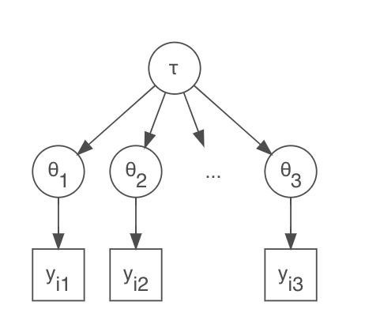

Bayesian Data Analysis - Bayesian Hierarchical Models
================
Dr Niamh Cahill (she/her)


## Hierarchical Binomial Model

Suppose we are considering the success of a treatment for cardio
vascular disease (CVD) in a number of different hospitals. We are
interested in $\theta_j$ the survival probability associated with
hospital $j$.

We have observations $y_{ij}$ which tells us the status of patient $i$
in hospital $j$ such that $y_{ij} = 1$ if the patient survived and
$y_{ij} = 0$ otherwise.

We could assume that $\theta_j$ are independent

<!-- -->


## Hierarchical Binomial Model

We could assume that there’s a joint effect i.e., a common $\theta$

<!-- -->


## Hierarchical Binomial Model

But maybe it’s more sensible to assume that we have different $\theta_j$
but that they are similar

<!-- -->


A natural assumption to make is that $\theta_j$ have a common population
distribution

Now we are building up levels. We have a data level, a parameter level
and a hyperparameter level

## Hierarchical Models - Terms

**The data level:** observations given parameters $p(y_{ij}|\theta_j)$

**The parameter level:** parameters given hyperparameters
$p(\theta_j|\tau)$

**The hyperparameter level:** $p(\tau)$

Putting all of this together in Bayes’ theorem we get:

$p(\theta, \tau|y) \propto p(y|\theta)p(\theta|\tau)p(\tau)$

## Hierarchical Models - Rats example

In the evaluation of drugs for possible clinical application, studies
are routinely performed on rodents.

Suppose we have studies to estimate $\theta$, the probability of a tumor
in a population of female laboratory rats of type ‘F344’ that receive a
zero dose of the drug (a control group).

The data are whether the rat developed endometrial stromal polyps (a
kind of tumor)

The experiment has been repeated 71 times

    ##  [1] "0/20"  "0/20"  "0/20"  "0/20"  "0/20"  "0/20"  "0/20"  "0/19"  "0/19" 
    ## [10] "0/19"  "0/19"  "0/18"  "0/18"  "0/17"  "1/20"  "1/20"  "1/20"  "1/20" 
    ## [19] "1/19"  "1/19"  "1/18"  "1/18"  "2/25"  "2/24"  "2/23"  "2/20"  "2/20" 
    ## [28] "2/20"  "2/20"  "2/20"  "2/20"  "1/10"  "5/49"  "2/19"  "5/46"  "3/27" 
    ## [37] "2/17"  "7/49"  "7/47"  "3/20"  "3/20"  "2/13"  "9/48"  "10/50" "4/20" 
    ## [46] "4/20"  "4/20"  "4/20"  "4/20"  "4/20"  "4/20"  "10/48" "4/19"  "4/19" 
    ## [55] "4/19"  "5/22"  "11/46" "12/49" "5/20"  "5/20"  "6/23"  "5/19"  "6/22" 
    ## [64] "6/20"  "6/20"  "6/20"  "16/52" "15/46" "15/47" "9/24"  "4/14"

<!-- For a particular study drawn from the statistical literature, suppose the immediate aim is to estimate $\theta$, the probability of tumor in a population of female laboratory rats of type ‘F344’ that receive a zero dose of the drug (a control group). The data show that 4 out of 14 rats developed endometrial stromal polyps (a kind of tumor). It is natural to assume a binomial model for the number of tumors, given $\theta$. For convenience, we select a prior distribution for θ from the conjugate family, θ ∼ Beta(α, β). -->

## Hierarchical Models - Rats example

Let’s specify a Bayesian Hierarchical model for the rats example. Let
$y_j$ be the number of rats that had tumors in study $j$ and let $n_j$
be the total number of rats in study $j$. It is natural to assume a
binomial model for the number of tumors, given $\theta_j$ and we can
select a prior distribution for $\theta_j$ from the conjugate family and
vague priors for the hyperparameters.

$y_j|\theta_j \sim Binomial(\theta_j,n_j)$

$\theta_j|\alpha,\beta \sim Be(\alpha, \beta)$

$\alpha \sim ht(1,10^2,1)$ $\beta \sim ht(1,10^2,1)$

<!-- -->


## Hierarchical Models - Rats example

<!-- -->

## Hierarchical Models - Rats example

<!-- -->

## Hierarchical Models - Rats example

Summary of hyperparameters $\alpha$ and $\beta$ from the population Beta
prior distribution

| .variable |    .value |   .lower |    .upper | .width | .point | .interval |
|:----------|----------:|---------:|----------:|-------:|:-------|:----------|
| alpha     |  2.461633 | 1.387249 |  5.623273 |   0.95 | median | qi        |
| beta      | 14.568460 | 8.400002 | 33.967424 |   0.95 | median | qi        |

$Beta(\alpha, \beta)$ given posterior draws of $\alpha$ and $\beta$

<!-- -->

## Hierarchical Normal Model

Assume a factory has 6 machines and a quality measure that is taken on a
regular basis.

How might we structure a hierarchical model such that we get an overall
estimate of quality across all machines as well as a quality estimate
per machine?

<!-- -->

$y_{ij} \sim N(\mu_j,\sigma^2)$

$\mu_j \sim N(\mu_F, \sigma_F^2)$

$\mu_F \sim N(0,1)$

$\sigma_F \sim ht(0,1,1)$

## Hierarchical Normal Model

You might also consider that the variation in quality measures is not
constant across all machines.

<!-- -->

## Hierarchical normal model: 8 schools

-   A study was performed for the Educational Testing Service to analyze
    the effects of special coaching programs on test scores

-   Separate randomized experiments were performed to estimate the
    effects of coaching programs for the SAT (Scholastic Aptitude Test)
    in each of eight high schools.

-   The outcome variable in each study was the score on the SAT

-   Typically the scores can vary between 200 and 800, with a mean = 500
    and standard deviation = 100.

-   The SAT examinations are designed to be resistant to short-term
    efforts directed specifically toward improving performance on the
    test; instead they are designed to reflect knowledge acquired and
    abilities developed over many years of education.

-   Nevertheless, each of the eight schools in this study considered its
    short-term coaching program to be successful at increasing SAT
    scores.

## Hierarchical normal model: 8 schools

-   The performance gains of coached students were compared to
    non-coached students. Separate estimates were obtained for each
    school, but because the size of the schools differed, the standard
    errors differed as well.

-   In each school the estimated coaching effect and its standard error
    were obtained.

<!-- -->

    ##    y se
    ## 1 28 15
    ## 2  8 10
    ## 3 -3 16
    ## 4  7 11
    ## 5 -1  9
    ## 6  1 11
    ## 7 18 10
    ## 8 12 18

## Hierarchical normal model: 8 schools

-   Upon initial examination of the data it may seem that some coaching
    programs have moderate effects (in the range 18–28 points), most
    have small effects (0–12 points), and two have small negative
    effects.

    -   However, when we take note of the standard errors of these
        estimated effects, we see that it is difficult statistically to
        distinguish between any of the experiments.

    -   Let’s assume however that we treat every experiment separately

## Hierarchical normal model: 8 schools

<!-- -->

## Hierarchical normal model: 8 schools

The general overlap in the posterior intervals based on independent
analyses suggests that all experiments might be estimating the same
quantity.

-   Is the effect actually the same everywhere i.e., is there one common
    coaching effect?

-   Under the hypothesis that all experiments have the same effect and
    produce independent estimates of this common effect, we could treat
    the data as eight normally distributed observation with an overall
    mean and known variances.

-   But, would it be possible to have an effect of 28 in one school just
    by chance if the coaching effect across all schools is the same?

## Issues with spearate and pooled effects

Let’s consider schools A, with the separate effects model we infer that
for school A there is a 50% chance that the true effect is greater than
28.

<!-- -->

## Issues with spearate and pooled effects

With the pooled effects model, we infer that there is a 50% chance that
the true effect is less than 7.5.

<!-- -->

## Issues with spearate and pooled effects

The separate effects model treats School A completely in isolation,
ignoring the fact that we have considerable evidence that courses
similar to the one taught in School A evidently have typical effect size
less than 20 points.

The pooled effects model would assume that the true effect in all
schools is exactly equal, in spite of the courses being taught by
different teachers to different students.

What about a middle path?

## Hierarchical Normal Model - 8 Schools

1.  Assume that each school’s “true effect” is drawn from a normal
    distribution with unknown mean and standard deviation

2.  Assume the observed effect in each school is sampled from a normal
    distribution with a mean equal to the true effect, and standard
    deviation given in the dataset.

<!-- -->

$y_{i} \sim N(\mu_i,\sigma_i^2)$

$\mu_i \sim N(\mu_P, \sigma_P^2)$

$\mu_P \sim N(0,200^2)$

$\sigma_P \sim Uniform(0,200)$

## Hierarchical Normal Model - 8 Schools

**Posterior distribution for the effects**

<!-- -->

## Hierarchical Normal Model - 8 Schools

**Effect summaries**

    ## # A tibble: 8 × 8
    ##   school .variable .value .lower .upper .width .point .interval
    ##    <int> <chr>      <dbl>  <dbl>  <dbl>  <dbl> <chr>  <chr>    
    ## 1      1 mu.i       10.9   -2.72   31.7   0.95 median qi       
    ## 2      2 mu.i        8.11  -4.68   20.3   0.95 median qi       
    ## 3      3 mu.i        6.73 -11.9    20.4   0.95 median qi       
    ## 4      4 mu.i        8.16  -5.84   20.7   0.95 median qi       
    ## 5      5 mu.i        5.28  -9.62   16.0   0.95 median qi       
    ## 6      6 mu.i        6.58  -9.28   18.5   0.95 median qi       
    ## 7      7 mu.i       10.9   -1.33   26.5   0.95 median qi       
    ## 8      8 mu.i        8.68  -8.32   25.9   0.95 median qi

## What about $\sigma_p$?

**Posterior distribution of $\sigma_p$**

<!-- -->

## What about $\sigma_p$?

**What happens to $\mu_i$ as $\sigma_p$ changes?**

<!-- -->


## R Code for Binomial BHM in JAGS

```{r}
library(tidyverse)
library(rjags)
library(R2jags)
library(tidybayes)

## data
rats <- read_csv("rats.csv")

# independent model ------------------------------------------------------------

simple = "model{

for(j in 1:M)
{
y_j[j] ~ dbinom(theta_j[j],N_j[j])

#prior
theta_j[j] ~ dbeta(1,1)

#predicitive distribution
yrep[j] ~ dbinom(theta_j[j],N_j[j])
}
}
"

# pooled model ------------------------------------------------------------


pooled = "model{

for(j in 1:M)
{
y_j[j] ~ dbinom(theta,N_j[j])

}
# prior
theta ~ dbeta(1,1)

#predicitive distribution
for(j in 1:M) {yrep[j] ~ dbinom(theta,N_j[j])}

}
"


# hierarchical model ------------------------------------------------------


bhm = "model{

for(j in 1:M)
{
y_j[j] ~ dbinom(theta_j[j],N_j[j])
theta_j[j] ~ dbeta(alpha,beta)
}

# hyperparameter priors
alpha ~ dt(1,10^-2,1)T(0,)
beta ~ dt(1,10^-2,1)T(0,)

#predicitive distribution
for(j in 1:M){yrep[j] ~ dbinom(theta_j[j],N_j[j])}

}
"

## data
jags_data <- list(M = nrow(rats),
                  y_j = rats$y,
                  N_j = rats$N)

## parameters to monitor
parnames1 <- c("theta_j","yrep")
parnames2 <- c("theta","yrep")
parnames3 <- c("theta_j", "alpha","beta","yrep")

# run independent theta model ---------------------------------------------

mod1 <- jags(data = jags_data, 
             parameters.to.save=parnames1, 
             model.file = textConnection(simple))

plot(mod1)

## output
m1 <- mod1$BUGSoutput$sims.matrix
theta_ind <- factor(1:nrow(rats)) 
theta_dat1 <- m1 %>% spread_draws(theta_j[theta_ind]) %>% 
  dplyr::select(theta_ind, theta_j) %>% dplyr::ungroup() %>% 
  dplyr::mutate(theta_ind = as.factor(theta_ind))

## plotting
p1 <- ggplot(theta_dat1, aes(x = theta_j, colour = theta_ind)) +
  geom_density() +
  theme_bw() +
  theme(legend.position = "none")+
  xlim(c(0,1)) +
  theme(axis.title.y = element_blank(),
        axis.text.y = element_blank(),
        axis.ticks.y = element_blank()) +
  ggtitle("Separate Model")
p1

## PPC
y <- rats$y
yrep <- mod1$BUGSoutput$sims.list$yrep

library(bayesplot)
color_scheme_set("brightblue")
ppc_bars(y, yrep[1:50, ])

d <- function(x) max(x) - min(x)
ppc_stat(y,yrep, stat = "d") 


# run pooled model --------------------------------------------------------

mod2 <- jags(data = jags_data, 
             parameters.to.save=parnames2, 
             model.file = textConnection(pooled))

m2 <- mod2$BUGSoutput$sims.matrix
theta_dat2 <- m2 %>% spread_draws(theta) 

p2 <- ggplot(theta_dat2, aes(x = theta)) +
  geom_density() +
  theme_bw() + 
  theme(legend.position = "none")+
  xlim(c(0,1)) +
  theme(axis.title.y = element_blank(),
        axis.text.y = element_blank(),
        axis.ticks.y = element_blank()) +
  ggtitle("Pooled Model")
p2

## PPC
y <- rats$y
yrep <- mod2$BUGSoutput$sims.list$yrep

ppc_bars(y, yrep[1:50, ])

d <- function(x) max(x) - min(x)
ppc_stat(y,yrep, stat = "d") 


# run BHM -----------------------------------------------------------------


mod3 <- jags(data = jags_data, 
             parameters.to.save=parnames3, 
             model.file = textConnection(bhm))

m3 <- mod3$BUGSoutput$sims.matrix
theta_ind <- factor(1:nrow(rats)) 
theta_dat3 <- m3 %>% spread_draws(theta_j[theta_ind]) %>% 
  dplyr::select(theta_ind, theta_j) %>% dplyr::ungroup() %>% 
  dplyr::mutate(theta_ind = as.factor(theta_ind))

p3 <- ggplot(theta_dat3, aes(x = theta_j, colour = theta_ind)) +
  geom_density() +
  theme_bw() + 
  theme(legend.position = "none") +
  xlim(c(0,1)) +
  theme(axis.title.y = element_blank(),
        axis.text.y = element_blank(),
        axis.ticks.y = element_blank()) +
  ggtitle("Hierarchical Model")
p3

## PPC
y <- rats$y
yrep <- mod3$BUGSoutput$sims.list$yrep

ppc_bars(y, yrep[1:50, ])

d <- function(x) max(x) - min(x)
ppc_stat(y,yrep, stat = "d") 

## population prior 
par_dat <- m3 %>% spread_draws(alpha, beta)

theta_grid <- seq(0,1,0.01)
n_samps <- 20
beta_pdf <- matrix(NA,nrow = length(theta_grid),n_samps)
for(s in 1:n_samps)
{
  beta_pdf[,s] <- dbeta(theta_grid,par_dat$alpha[s],par_dat$beta[s])
}
beta_pdf <- data.frame(beta_pdf)
colnames(beta_pdf) <- 1:n_samps
beta_pdf$theta_grid <- theta_grid

beta_pdf_long <- tibble(beta_pdf) %>% pivot_longer(-theta_grid, 
                                                   names_to = "sample", 
                                                   values_to = "density")

p4 <- ggplot(beta_pdf_long, aes(x = theta_grid, y = density,group = sample)) +
  geom_line() +
  xlab("theta") +
  theme_bw() +
  ggtitle("Population (Beta) Prior")
p4
```

## R Code for Normal BHM in JAGS

```{r}
library(tidyverse)
library(rjags)
library(R2jags)
library(tidybayes)

## get schools data
library(Rgbp)
data(schools)
schools

## BHM Normal model 
bhm_normal = "
model{

for(i in 1:N)
{
## data model
 y.i[i] ~ dnorm(mu.i[i],sigma.i[i]^-2)

## priors
mu.i[i] ~ dnorm(mu_p,sigma_p^-2)

}## end of i loop

mu_p ~ dnorm(0,200^-2)
sigma_p ~ dunif(0,200)

 }
 "

# data
jags.data <- list(y.i = schools$y, 
                  sigma.i = schools$se,
                  N = nrow(schools))
# parameters 
parnames <- c("mu.i","mu_p","sigma_p")
  
# run model
mod <- jags(data = jags.data, 
            parameters.to.save = parnames, 
            model.file = textConnection(bhm_normal),
            n.iter = 10000,
            n.burnin = 2000,
            n.thin = 4)

# quick convergence check  
plot(mod)

# output
m <- mod$BUGSoutput$sims.matrix

school <- 1:8
sep_mu_samps <- m %>% spread_draws(mu.i[school]) 

p <-   ggplot(sep_mu_samps,aes(x = mu.i, y = factor(school,labels = letters[1:8]))) +
  stat_halfeye() +
  ylab("")
p

# summary of effects (mu.i)
par_summary <- m %>% 
  gather_rvars(mu.i[school]) %>% 
  median_qi(.value)
par_summary

# look at sigma_p (across school variation for effects)
sigma_p_samps <- m %>% spread_draws(sigma_p) 

ggplot(sigma_p_samps, aes(x = sigma_p)) +
  geom_density() +
  theme_bw()

```
